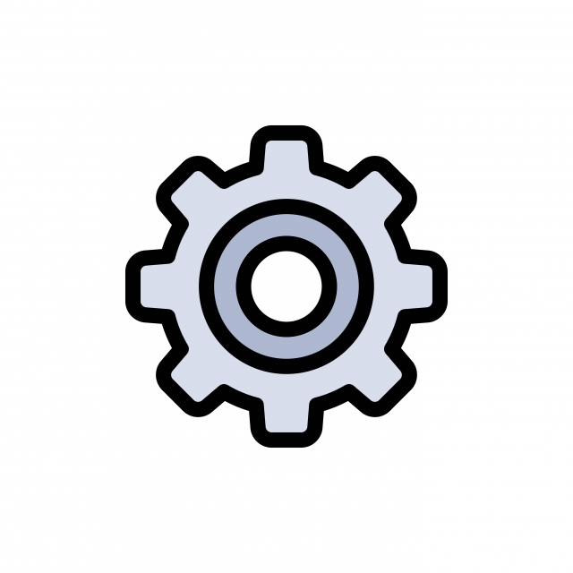

  

&#xa0;

<a href="">Demo</a>

<h1 align="center">webcomponents</h1>

  

  

  

  

  

  

  

 

## :dart: About

Componentes onde seu objetivo é que sejam reutilizáveis e adaptáveis independente do layout que for aplicado;

## :rocket: Technologies

The following tools were used in this project:

-   [HTML](https://developer.mozilla.org/pt-BR/docs/Web/HTML)
-   [CSS](https://developer.mozilla.org/pt-BR/docs/Web/CSS)
-   [Javascript](https://developer.mozilla.org/pt-BR/docs/Web/JavaScript)

## :white_check_mark: Requirements

Before starting :checkered_flag:, you need to have [Git](https://git-scm.com) installed.

## :memo: License

This project is under license from MIT. For more details, see the [LICENSE](LICENSE.md) file.

Made with :heart: by <a href="https://github.com/miguelrisquelme" target="_blank">Miguel Riquelme</a>, <a href="https://github.com/Manocchio" target="_blank">Gustavo Manocchio</a>, <a href="https://github.com/gustconti" target="_blank">Gustavo Conti</a> and <a href="https://github.com/hiperesp" target="_blank">Gabriel Lopes</a>

&#xa0;

<a href="#top">Back to top</a>
